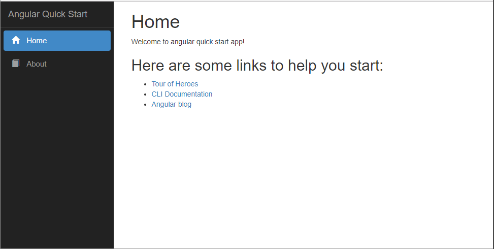
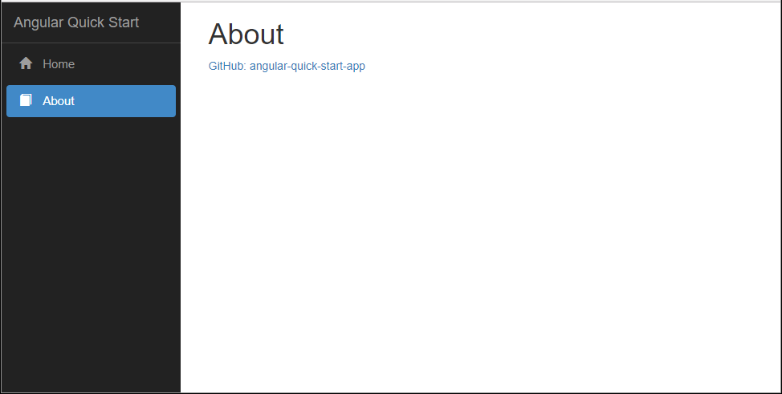

# Angular Quick Start App
The objective of this quick start application is to provide a simple way to get started with Angular 4 application. This sample application relies on Angular CLI to build the run.

### This application is generated with:
* [Angular CLI](https://github.com/angular/angular-cli) `version 1.4.7`
* Node: `version 6.11.4`
* npm: `version 3.10.10`
* TypeScript: `version 2.5.3`

### Key Functionality:
Following functionality applied on the top of key features and functionality comes with Angular CLI default project creation.
* Router module for routing
* Bootstrap responsive template with navigate menu

## Running the Application
1. Run `npm install`
1. Run `ng serve`
1. Go to http://localhost:4200/ in your browser 

## Build
Run `ng build` to build the project. The build artifacts will be stored in the `dist/` directory. Use the `-prod` flag for a production build.

## Running unit tests
Run `ng test` to execute the unit tests

## Running end-to-end tests
Run `ng e2e` to execute the end-to-end tests

## Further help
To get more help on the Angular CLI use `ng help` or go check out the [Angular CLI README](https://github.com/angular/angular-cli/blob/master/README.md).

## Here are a few screenshots from the app:

  
