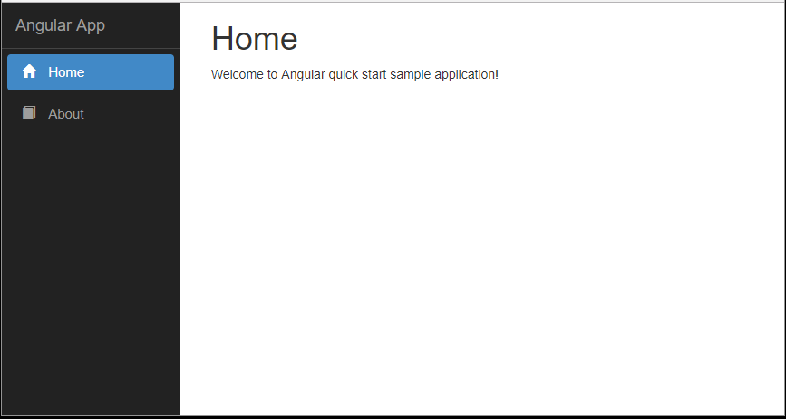
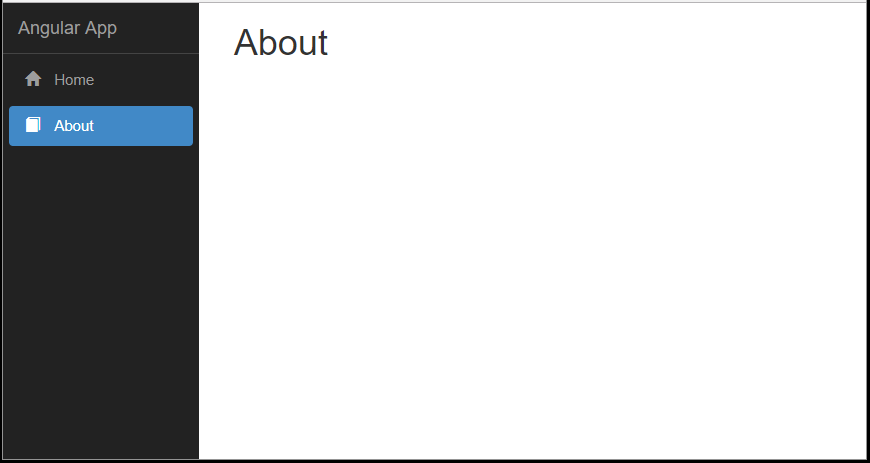

# Angular Quick Start App
The objective of this quick start application is to provide a simple way to get started with Angular 4 application. This sample application relies on Angular CLI to build the run.

>### This application is generated with:
* [Angular CLI](https://github.com/angular/angular-cli) `version 1.6.0`
* Node: `version 6.11.4`
* npm: `version 3.10.10`
* TypeScript: `version 2.6.2`

>### Key Functionality:
* Router module for routing
* Bootstrap responsive template with navigate menu

## Running the Application
1. Run `npm install`
1. Run `ng serve`
1. Go to http://localhost:4200/ in your browser 

## Useful Commands
* Run `ng build` to build the project.
* Run `ng build --prod` to build the project for prod
* Run `ng test` to execute the unit tests
* Run `ng e2e` to execute the end-to-end tests
* To get more help on the Angular CLI use `ng help` or go check out the [Angular CLI README](https://github.com/angular/angular-cli/blob/master/README.md).

## Screenshots

  

